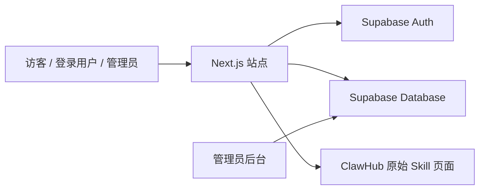
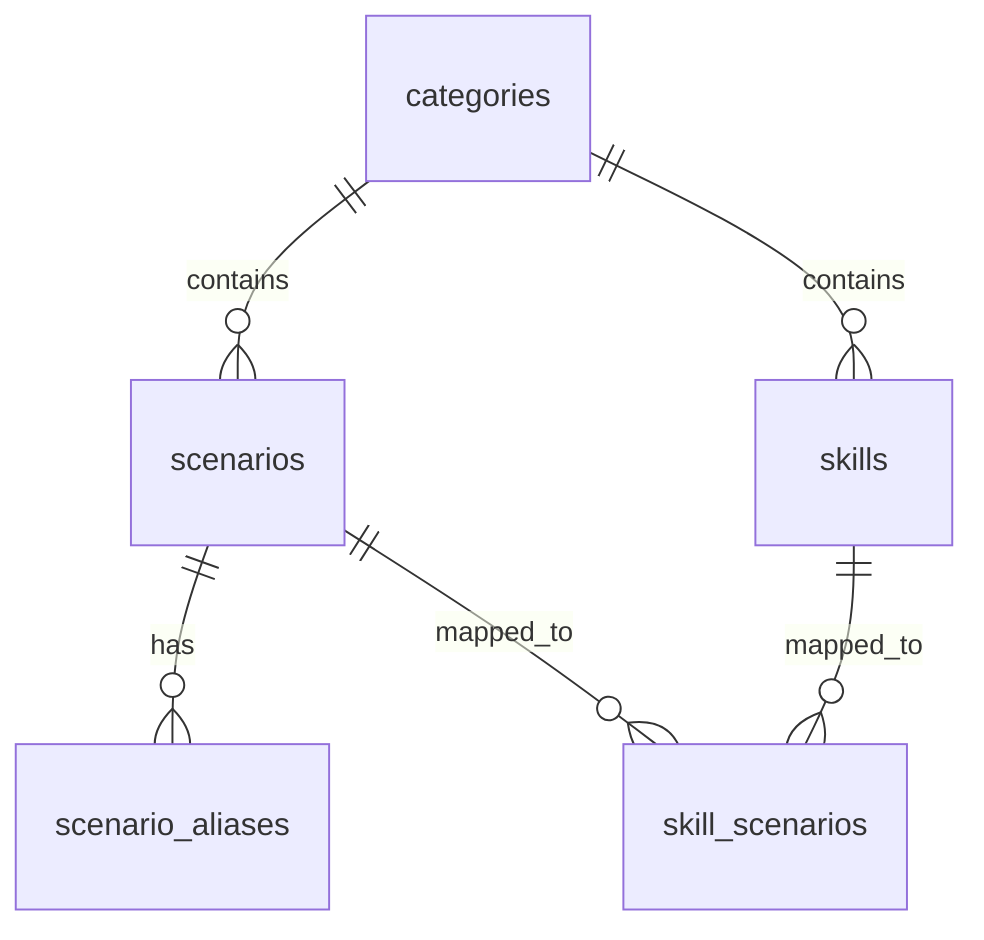

# OpenClaw Skills for Authors 项目说明书

## 一、项目简介

`OpenClaw Skills for Authors` 是一个面向创作者的垂直筛选站点。  
它不是简单把全网 Skill 堆出来，而是先按创作类别与工作环节做结构化筛选，再把用户带到可直接使用的原始 Skill 页面。

当前覆盖 6 个核心创作方向：

- 写书
- 写文章
- 写文案
- 写报告
- 写论文
- 写课程

项目的核心目标很明确：

1. 帮创作者从“我要解决什么问题”出发找 Skill，而不是从技术名词出发搜索。
2. 建立一个可持续运营、可筛选、可扩展的 Skills 内容入口。
3. 尽量只保留能稳定跳转到原始来源、可继续安装或使用的条目。

---

## 二、项目当前价值

相比用户直接去 ClawHub 或其他平台搜索，本项目当前提供 4 层明确价值：

### 1. 先按任务筛，不按技术词筛

用户进入站点后，不需要先理解 Skill 名称，而是可以先按：

- 写书 / 写文章 / 写文案 / 写报告 / 写论文 / 写课程
- 选题、调研、资料整理、大纲、正文、润色、质检等工作环节

来定位自己当前的问题。

### 2. 先筛可用，再给入口

站内不是“展示所有可能相关的 Skill”，而是优先展示：

- 更适合特定创作场景的 Skill
- 人工筛选过的条目
- 可直接跳转到原始 Skill 页的条目

这能减少用户点进去以后发现“页面失效”“没有安装入口”“不适合当前任务”的情况。

### 3. 兼顾精选入口与检索入口

每个分类页都同时提供两种入口：

- `本周精选 Skills`：先看少量高质量推荐
- `按工作环节搜索`：按当前任务快速找对应 Skills

这让新用户和老用户都能快速上手。

### 4. 已经具备产品化基础

当前版本已经不是纯静态展示页，而是具备了：

- 用户登录
- Skill 推荐提交
- 管理员后台查看推荐记录
- 数据库与权限基础

这意味着它可以继续从“内容项目”演进成“可运营产品”。

---

## 三、当前已完成的内容

当前线上版本已经具备以下能力：

- 首页品牌页
- 6 个分类页
- 每个分类页的工作环节搜索
- 每个分类页的精选 Skills 模块
- Skill 详情页
- Google 登录
- 用户提交推荐 Skill
- 管理员后台查看提交记录
- Vercel 生产部署
- 自定义域名访问

线上地址：

- [https://www.clawauthor.com](https://www.clawauthor.com)

代码仓库：

- [https://github.com/yezizhizhi/openclaw-skills-authors](https://github.com/yezizhizhi/openclaw-skills-authors)

---

## 四、面向用户的使用方式

### 1. 普通访客怎么使用

用户使用路径非常简单：

1. 进入首页
2. 选择创作类别
3. 先看精选 Skills，或直接输入当前工作环节
4. 找到合适的 Skill
5. 跳转到原始 Skill 页面继续安装或使用

### 2. 已登录用户可以多做什么

登录后，用户除了浏览外，还可以：

- 提交新的 Skill 推荐
- 提交 Skill 链接或 Skill 包
- 说明为什么这个 Skill 值得收录

### 3. 管理员可以做什么

管理员登录后可以：

- 进入后台查看所有推荐提交
- 查看提交链接、技能包地址、推荐理由、提交邮箱与提交时间
- 后续做审核、收录、忽略等处理

---

## 五、站点结构说明

### 1. 首页

首页主要承担：

- 品牌展示
- 分类入口
- 热门精选 Skills
- 产品价值说明
- FAQ

对应文件：

- [/Users/shufanxyzr/codebase/ainenglishnamegen/openclaw-skills-authors/app/page.tsx](/Users/shufanxyzr/codebase/ainenglishnamegen/openclaw-skills-authors/app/page.tsx)

### 2. 分类页

每个分类页采用统一结构：

1. 第一屏：类别定位、适用场景、副标题、CTA
2. 第二屏：按工作环节搜索 Skills
3. 第三屏：本周精选 Skills

当前分类包括：

- `/categories/books`
- `/categories/articles`
- `/categories/copywriting`
- `/categories/reports`
- `/categories/academic`
- `/categories/courses`

对应文件：

- [/Users/shufanxyzr/codebase/ainenglishnamegen/openclaw-skills-authors/app/categories/[slug]/page.tsx](/Users/shufanxyzr/codebase/ainenglishnamegen/openclaw-skills-authors/app/categories/[slug]/page.tsx)

### 3. Skill 详情页

Skill 详情页当前用于承接：

- Skill 名称
- 所属分类与工作环节
- 简短说明
- 复制配置 / 调用提示
- 跳转原始来源

对应文件：

- [/Users/shufanxyzr/codebase/ainenglishnamegen/openclaw-skills-authors/app/skills/[skillId]/page.tsx](/Users/shufanxyzr/codebase/ainenglishnamegen/openclaw-skills-authors/app/skills/[skillId]/page.tsx)

### 4. 推荐 / 提交页

该页面允许用户登录后提交新的 Skill 推荐，当前字段包括：

- Skill 链接
- Skill 包地址
- 推荐理由

对应文件：

- [/Users/shufanxyzr/codebase/ainenglishnamegen/openclaw-skills-authors/app/submit-skills/page.tsx](/Users/shufanxyzr/codebase/ainenglishnamegen/openclaw-skills-authors/app/submit-skills/page.tsx)
- [/Users/shufanxyzr/codebase/ainenglishnamegen/openclaw-skills-authors/components/submit-skill-form.tsx](/Users/shufanxyzr/codebase/ainenglishnamegen/openclaw-skills-authors/components/submit-skill-form.tsx)

### 5. 后台页

后台当前是一个管理员查看页，用于查看所有用户提交的推荐记录。

对应文件：

- [/Users/shufanxyzr/codebase/ainenglishnamegen/openclaw-skills-authors/app/admin/skill-submissions/page.tsx](/Users/shufanxyzr/codebase/ainenglishnamegen/openclaw-skills-authors/app/admin/skill-submissions/page.tsx)

---

## 六、系统架构

### 1. 总体结构


```

### 2. 技术栈

- 前端：`Next.js 16 + React 19`
- 样式：`Tailwind CSS 4 + 自定义样式`
- 数据库：`Supabase Postgres`
- 登录认证：`Supabase Auth + Google OAuth`
- 部署：`Vercel`
- 域名：`clawauthor.com`

### 3. 当前架构原则

本项目当前的实现遵循 4 个原则：

- 页面可先运行，再逐步切数据库
- 数据库优先，静态内容兜底
- 原始来源优先，站内只做筛选与引导
- 结果可解释、可维护，不做黑盒推荐

---

## 七、数据架构与推荐逻辑

### 1. 核心数据表

当前最小可用数据模型包括：

- `categories`
- `scenarios`
- `scenario_aliases`
- `skills`
- `skill_scenarios`
- `skill_submissions`

关系如下：


```

### 2. 这些表分别解决什么问题

`categories`

- 管理一级分类，如写书、写文章、写文案等

`scenarios`

- 管理每个分类下的工作环节，如选题调研、正文写作、终稿质检

`scenario_aliases`

- 解决近义词匹配问题，例如“大纲创建”和“章节提纲”可以归并到同一个标准环节

`skills`

- 存放 Skill 本体数据，包括名称、描述、来源链接、标签等

`skill_scenarios`

- 定义“某个工作环节对应哪些 Skill”，以及结果排序

`skill_submissions`

- 存放用户提交的推荐记录

### 3. 当前推荐逻辑

当用户在分类页第二屏输入一个工作环节时，系统流程如下：

1. 识别当前分类页
2. 用用户输入去匹配标准场景或场景别名
3. 找出该分类下对应的 Skill
4. 按预设排序返回结果
5. 用户直接跳转原始 Skill 页面继续使用

这套方式的优点是：

- 结果稳定
- 维护成本低
- 可逐步人工优化
- 适合后续加入更多运营规则

数据库定义文件：

- [/Users/shufanxyzr/codebase/ainenglishnamegen/openclaw-skills-authors/supabase/schema.sql](/Users/shufanxyzr/codebase/ainenglishnamegen/openclaw-skills-authors/supabase/schema.sql)

---

## 八、登录、权限与后台管理

### 1. 当前登录方式

当前已接入：

- Google 登录

用户点击顶部 `登录` 后，会弹出登录框；选择 Google 登录后进入标准 Google OAuth 授权流程。

说明：

- Google 授权页是标准 OAuth 步骤，属于正常流程
- 站点不直接保存用户的 Google 密码
- 登录完成后，可识别用户身份并开放提交能力

### 2. 当前权限层级

当前站点有 3 层身份：

#### 访客

- 浏览全部公开页面
- 查看分类页
- 查看精选 Skills
- 使用场景搜索

#### 登录用户

- 拥有访客全部能力
- 可以提交推荐 Skill

#### 管理员

- 拥有登录用户全部能力
- 可以进入后台查看所有提交记录

### 3. 管理员如何定义

管理员通过环境变量控制：

```text
ADMIN_EMAILS
```

只有登录邮箱出现在该变量中的用户，才会显示后台入口并拥有后台访问权限。

---

## 九、部署与配置说明

### 1. 部署方式

当前采用标准 Git 驱动部署：

1. 本地开发
2. 推送 GitHub `main`
3. Vercel 自动构建
4. 构建成功后自动更新线上版本

### 2. 基础环境变量

本地与 Vercel 都需要以下变量：

```bash
NEXT_PUBLIC_SUPABASE_URL=
NEXT_PUBLIC_SUPABASE_PUBLISHABLE_KEY=
NEXT_PUBLIC_SUPABASE_PUBLISHABLE_DEFAULT_KEY=
SUPABASE_SERVICE_ROLE_KEY=
ADMIN_EMAILS=
```

含义如下：

- `NEXT_PUBLIC_SUPABASE_URL`：Supabase 项目地址
- `NEXT_PUBLIC_SUPABASE_PUBLISHABLE_KEY`：前端公开访问所需 key
- `NEXT_PUBLIC_SUPABASE_PUBLISHABLE_DEFAULT_KEY`：兼容 Supabase 控制台提供的另一种命名
- `SUPABASE_SERVICE_ROLE_KEY`：后台接口与管理员读取所需的高权限 key
- `ADMIN_EMAILS`：管理员邮箱白名单

参考文件：

- [/Users/shufanxyzr/codebase/ainenglishnamegen/openclaw-skills-authors/.env.example](/Users/shufanxyzr/codebase/ainenglishnamegen/openclaw-skills-authors/.env.example)

### 3. Google 登录配置

Google 登录需要两端同步配置。

#### Google Cloud

创建 `OAuth 2.0 Web 应用客户端`，配置：

已获授权的 JavaScript 来源：

- `https://www.clawauthor.com`
- `http://localhost:3000`

已获授权的重定向 URI：

- `https://cfdmzfywisozcvrzwbgx.supabase.co/auth/v1/callback`

#### Supabase

在 `Authentication -> Providers -> Google` 中填写：

- Google Client ID
- Google Client Secret

在 `Authentication -> URL Configuration` 中配置：

`Site URL`

- `https://www.clawauthor.com`

`Redirect URLs`

- `https://www.clawauthor.com/auth/callback`
- `http://localhost:3000/auth/callback`
- `http://localhost:3001/auth/callback`

---

## 十、项目如何维护与扩展

当前这个项目适合从 3 个方向持续维护与扩展：

### 1. 内容维护

负责：

- 筛选适合不同创作环节的 Skill
- 维护分类页精选内容
- 定期替换失效来源

### 2. 产品迭代

负责：

- 观察用户提交的数据
- 判断哪些 Skill 值得收录
- 逐步形成收录标准与审核标准

### 3. 技术扩展

负责：

- 继续扩展数据库字段
- 增加后台审核动作
- 增加自动校验与失效检测
- 后续接入收藏、订阅、权限分层

---

## 十一、当前边界与下一阶段建议

### 当前已经具备

- 分类导航
- 场景搜索
- 精选推荐
- 登录
- 用户提交
- 管理后台
- 生产部署

### 当前尚未完成

- 收藏体系
- 订阅 / 付费
- 后台“收录 / 忽略 / 已处理”动作
- Skill 来源自动校验
- Search Console / GA4 / 点击行为统计

### 推荐的下一阶段顺序

建议按这个顺序继续推进：

1. 后台增加提交处理状态
2. 后台增加“标记收录 / 忽略”动作
3. 建立失效链接自动检查
4. 增加收藏与用户侧记录
5. 再接订阅与权限分层
6. 最后补行为统计和转化分析

---

## 十二、项目总结

`OpenClaw Skills for Authors` 当前已经不是单纯的展示页面，而是一套具备：

- 分类导航
- 工作环节搜索
- 真实 Skill 来源跳转
- 用户登录
- 推荐提交
- 管理后台
- 线上部署

能力的创作者 Skills 筛选平台。

它的核心逻辑不是“展示更多”，而是：

> 帮创作者更快从自己的工作环节出发，找到可直接使用的 Skill。

当前这个项目的意义在于：

- 它已经可以作为面向创作者的垂直导航站运营
- 它也已经具备继续扩展为“登录 + 推荐提交 + 后台审核 + 订阅权限”的产品基础

如果继续推进，这个项目最适合的发展方向是：

**从精选导航站，逐步演进成一个面向创作者的 Skills 筛选与运营平台。**
