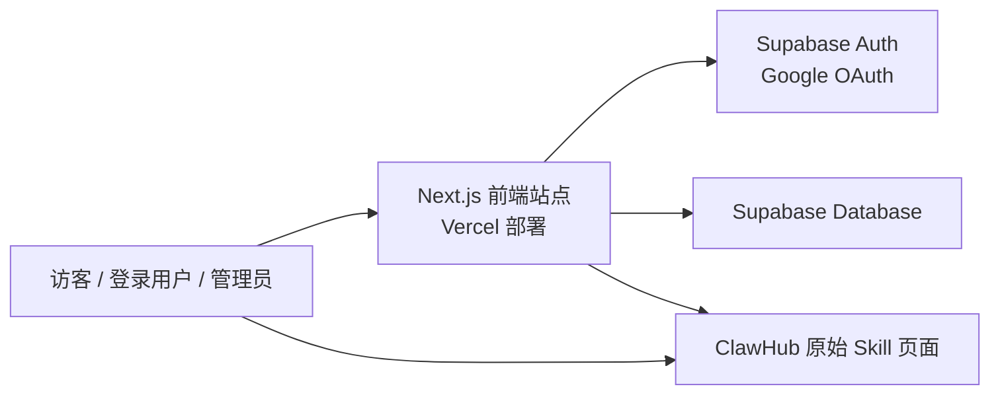
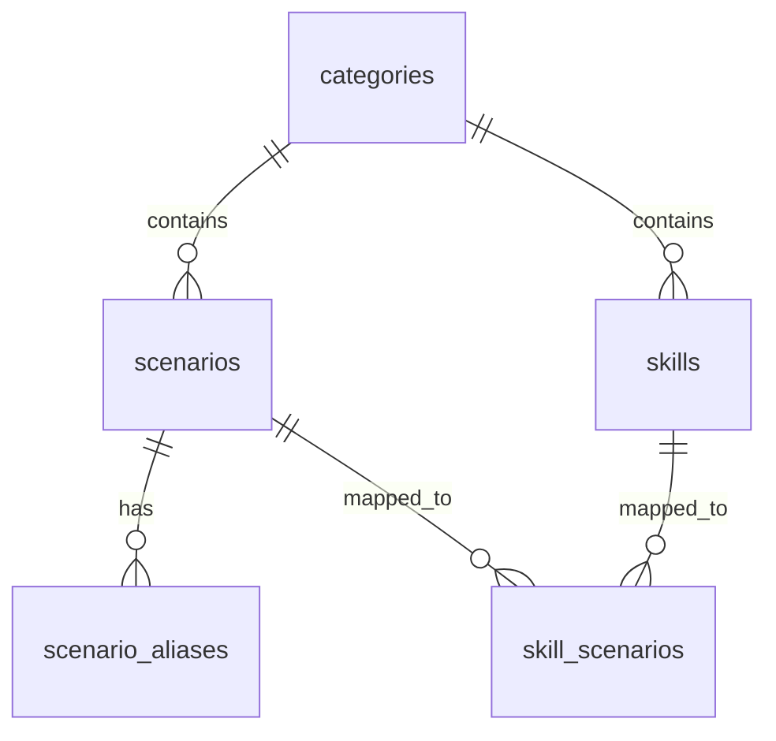
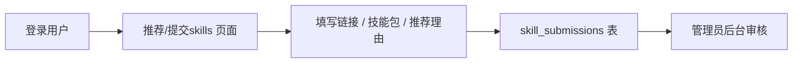

# OpenClaw Skills for Authors 项目架构说明书

## 1. 项目概述

### 1.1 项目定位

`OpenClaw Skills for Authors` 是一个面向创作者的垂直导航与筛选站点。  
项目的核心目标不是“把所有 Skill 堆出来”，而是先按创作类别和工作环节筛选，再把用户带到可以直接使用的原始 Skill 页面。

当前面向的主要创作类别包括：

- 写书
- 写文章
- 写文案
- 写报告
- 写论文
- 写课程

### 1.2 核心价值

相对于用户直接去 ClawHub 全站搜索，本项目提供了三层价值：

1. 先按创作任务分门别类，降低搜索成本。
2. 只优先展示经过人工筛选、适合特定工作环节的 Skill。
3. 尽量只保留能稳定跳转到原始 Skill 页面、可继续安装或使用的条目。

### 1.3 当前站点状态

当前站点已完成：

- 首页与 6 个分类页
- 分类页“精选 Skills + 场景搜索”双入口
- Skill 详情页
- Google 登录
- 用户提交推荐 Skill
- 管理员后台查看提交列表
- Vercel 生产部署与自定义域名上线

当前生产地址：

- [https://www.clawauthor.com](https://www.clawauthor.com)

代码仓库：

- [https://github.com/yezizhizhi/openclaw-skills-authors](https://github.com/yezizhizhi/openclaw-skills-authors)

---

## 2. 系统架构

### 2.1 总体架构



### 2.2 技术栈

- 前端框架：`Next.js 16`
- UI 层：`React 19`
- 样式系统：`Tailwind CSS 4 + 自定义样式`
- 数据层：`Supabase Postgres`
- 登录认证：`Supabase Auth + Google OAuth`
- 部署平台：`Vercel`
- 域名：`clawauthor.com`

### 2.3 架构原则

本项目采用以下实现原则：

- 页面层与数据层解耦：页面可以先以静态数据运行，再逐步切换到真实数据库。
- 数据库优先，静态兜底：当数据库可用时优先读取数据库；未配置时回退静态内容，不阻塞站点访问。
- 原始来源优先：站内展示的是经过筛选的入口，不替代原始 Skill 生态。
- 只做可解释的筛选：当前优先采用“人工筛选 + 结构化映射”的方式，而不是完全黑盒推荐。

---

## 3. 页面与功能结构

### 3.1 首页

首页承担品牌介绍、入口导航和信任建立的作用，主要包含：

- Hero 主屏
- 六大分类入口
- 热门精选 Skills
- 为什么选择这个 Skills 库
- FAQ

对应文件：

- [/Users/shufanxyzr/codebase/ainenglishnamegen/openclaw-skills-authors/app/page.tsx](/Users/shufanxyzr/codebase/ainenglishnamegen/openclaw-skills-authors/app/page.tsx)

### 3.2 分类页

每个分类页都采用统一结构：

1. 第一屏：类别定位 + 副标题 + 当前工作流标签
2. 第二屏：按工作环节搜索 Skill
3. 第三屏：本周精选 Skills

当前分类包括：

- `/categories/books`
- `/categories/articles`
- `/categories/copywriting`
- `/categories/reports`
- `/categories/academic`
- `/categories/courses`

对应文件：

- [/Users/shufanxyzr/codebase/ainenglishnamegen/openclaw-skills-authors/app/categories/[slug]/page.tsx](/Users/shufanxyzr/codebase/ainenglishnamegen/openclaw-skills-authors/app/categories/[slug]/page.tsx)

### 3.3 Skill 详情页

Skill 详情页负责展示：

- Skill 名称
- 所属分类 / 工作环节
- 简短说明
- 调用提示或配置复制
- 前往原始来源入口

对应文件：

- [/Users/shufanxyzr/codebase/ainenglishnamegen/openclaw-skills-authors/app/skills/[skillId]/page.tsx](/Users/shufanxyzr/codebase/ainenglishnamegen/openclaw-skills-authors/app/skills/[skillId]/page.tsx)

### 3.4 搜索入口页

顶部导航中的 `快速搜索skills` 会直达搜索入口，帮助用户尽快进入场景筛选。

对应文件：

- [/Users/shufanxyzr/codebase/ainenglishnamegen/openclaw-skills-authors/app/search-skills/page.tsx](/Users/shufanxyzr/codebase/ainenglishnamegen/openclaw-skills-authors/app/search-skills/page.tsx)

### 3.5 安装指南页

安装指南页已经被简化成最直接的三步：

1. 先选分类
2. 再搜工作环节
3. 直接跳转安装

对应文件：

- [/Users/shufanxyzr/codebase/ainenglishnamegen/openclaw-skills-authors/app/install-guide/page.tsx](/Users/shufanxyzr/codebase/ainenglishnamegen/openclaw-skills-authors/app/install-guide/page.tsx)

### 3.6 推荐 / 提交页

用户登录后，可以提交：

- Skill 链接
- Skill 包地址
- 推荐理由

对应文件：

- [/Users/shufanxyzr/codebase/ainenglishnamegen/openclaw-skills-authors/app/submit-skills/page.tsx](/Users/shufanxyzr/codebase/ainenglishnamegen/openclaw-skills-authors/app/submit-skills/page.tsx)
- [/Users/shufanxyzr/codebase/ainenglishnamegen/openclaw-skills-authors/components/submit-skill-form.tsx](/Users/shufanxyzr/codebase/ainenglishnamegen/openclaw-skills-authors/components/submit-skill-form.tsx)

### 3.7 后台页

管理员可以查看所有用户提交的推荐记录。

对应文件：

- [/Users/shufanxyzr/codebase/ainenglishnamegen/openclaw-skills-authors/app/admin/skill-submissions/page.tsx](/Users/shufanxyzr/codebase/ainenglishnamegen/openclaw-skills-authors/app/admin/skill-submissions/page.tsx)

---

## 4. 数据架构

### 4.1 数据模型概览

当前最小可用数据模型包括 6 张核心表：



### 4.2 数据表说明

#### `categories`

存放一级分类，如：

- books
- articles
- copywriting
- reports
- academic
- courses

#### `scenarios`

存放某个分类下的工作环节，如：

- 选题调研
- 大纲创建
- 资料整理
- 正文写作

#### `scenario_aliases`

处理同义词与近义表达，如：

- `大纲创建`
- `大纲生成`
- `章节提纲`

最终都可以映射到同一个标准场景。

#### `skills`

存放 Skill 本体数据，包括：

- Skill ID
- 名称
- 所属分类
- 工作流标签
- 简短描述
- 原始来源链接
- 安装模式
- 标签
- 复制配置内容

#### `skill_scenarios`

负责把 Skill 与场景进行多对多映射，并记录：

- 关联关系
- 排序
- 相关度

#### `skill_submissions`

存放用户提交的推荐记录，包括：

- `skill_link`
- `skill_package`
- `recommendation_reason`
- `submitter_email`
- `submitter_user_id`
- `created_at`

### 4.3 数据库定义文件

数据库结构定义在：

- [/Users/shufanxyzr/codebase/ainenglishnamegen/openclaw-skills-authors/supabase/schema.sql](/Users/shufanxyzr/codebase/ainenglishnamegen/openclaw-skills-authors/supabase/schema.sql)

---

## 5. 搜索与筛选逻辑

### 5.1 当前推荐逻辑

用户在分类页第二屏输入一个工作环节，例如：

- `大纲创建`
- `资料整理`
- `终稿质检`

系统处理流程如下：

1. 识别当前所属分类页，如 `books`
2. 将用户输入与 `scenario_aliases` 做匹配
3. 找到标准场景 `scenario_id`
4. 通过 `skill_scenarios` 查出已映射的 Skill
5. 按 `sort_order + relevance_score` 返回结果

### 5.2 当前筛选原则

当前站内不是“全库搜索”，而是“分类内搜索 + 人工筛选结果优先”。  
这意味着：

- 结果更可控
- 更贴近创作工作流
- 更适合合作方后续继续运营维护

### 5.3 数据来源策略

当前 Skills 主要来自两种来源：

- 已验证可直达的 ClawHub Skill 页面
- 项目中的人工整理映射数据

项目当前坚持的原则是：

> 尽量只展示能稳定跳转到原始 Skill 页面、可以继续安装或使用的条目。

---

## 6. 登录、权限与后台

### 6.1 登录方式

当前已接入：

- Google 登录

说明：

- 顶部点击 `登录` 后，直接弹出登录框
- 用户可以在弹窗内触发 Google 登录
- Google 授权页是标准 OAuth 流程的一部分，不能完全省略

相关文件：

- [/Users/shufanxyzr/codebase/ainenglishnamegen/openclaw-skills-authors/components/auth-dialog-trigger.tsx](/Users/shufanxyzr/codebase/ainenglishnamegen/openclaw-skills-authors/components/auth-dialog-trigger.tsx)
- [/Users/shufanxyzr/codebase/ainenglishnamegen/openclaw-skills-authors/components/header-auth-button.tsx](/Users/shufanxyzr/codebase/ainenglishnamegen/openclaw-skills-authors/components/header-auth-button.tsx)
- [/Users/shufanxyzr/codebase/ainenglishnamegen/openclaw-skills-authors/app/auth/callback/page.tsx](/Users/shufanxyzr/codebase/ainenglishnamegen/openclaw-skills-authors/app/auth/callback/page.tsx)

### 6.2 权限层级

当前站点分为三类身份：

#### 访客

- 可浏览首页
- 可浏览分类页
- 可查看精选 Skill
- 可使用搜索

#### 登录用户

- 拥有访客全部能力
- 可提交推荐 Skill

#### 管理员

- 拥有登录用户全部能力
- 可访问后台提交列表

### 6.3 管理员定义方式

管理员通过环境变量控制：

```text
ADMIN_EMAILS
```

只有登录邮箱出现在 `ADMIN_EMAILS` 列表中的用户，才会在顶部看到 `后台` 入口并访问后台页。

### 6.4 后台数据读取方式

后台页会通过服务端接口读取所有提交记录，因此需要：

- `SUPABASE_SERVICE_ROLE_KEY`

对应 API：

- [/Users/shufanxyzr/codebase/ainenglishnamegen/openclaw-skills-authors/app/api/admin/skill-submissions/route.ts](/Users/shufanxyzr/codebase/ainenglishnamegen/openclaw-skills-authors/app/api/admin/skill-submissions/route.ts)

---

## 7. 用户提交流程

### 7.1 目标

合作方后续可以通过用户提交功能，低成本扩充 Skill 来源。

### 7.2 流程



### 7.3 当前提交字段

提交表单包括：

- Skills 链接
- Skills 包地址
- 推荐理由

后台可看到：

- 提交链接
- 技能包地址
- 推荐理由
- 提交账号
- 提交时间

---

## 8. 部署架构

### 8.1 Git 仓库

源码托管在 GitHub：

- [https://github.com/yezizhizhi/openclaw-skills-authors](https://github.com/yezizhizhi/openclaw-skills-authors)

### 8.2 部署方式

采用标准 Git 驱动部署：

1. 代码推送到 `main`
2. Vercel 自动触发构建
3. 构建成功后自动更新生产站

### 8.3 域名

当前绑定域名：

- [https://www.clawauthor.com](https://www.clawauthor.com)

---

## 9. 配置说明

### 9.1 本地与 Vercel 需要的环境变量

```bash
NEXT_PUBLIC_SUPABASE_URL=
NEXT_PUBLIC_SUPABASE_PUBLISHABLE_KEY=
NEXT_PUBLIC_SUPABASE_PUBLISHABLE_DEFAULT_KEY=
SUPABASE_SERVICE_ROLE_KEY=
ADMIN_EMAILS=
```

说明：

- `NEXT_PUBLIC_SUPABASE_URL`：Supabase 项目地址
- `NEXT_PUBLIC_SUPABASE_PUBLISHABLE_KEY`：前端读取公有数据
- `NEXT_PUBLIC_SUPABASE_PUBLISHABLE_DEFAULT_KEY`：兼容 Supabase 控制台另一种变量命名
- `SUPABASE_SERVICE_ROLE_KEY`：服务端管理读取与后台接口
- `ADMIN_EMAILS`：管理员邮箱白名单

参考模板：

- [/Users/shufanxyzr/codebase/ainenglishnamegen/openclaw-skills-authors/.env.example](/Users/shufanxyzr/codebase/ainenglishnamegen/openclaw-skills-authors/.env.example)

### 9.2 Google 登录配置

Google 登录需要两端同步配置：

#### Google Cloud

- 创建 `OAuth 2.0 Web Application`
- 配置：

已获授权的 JavaScript 来源：

- `https://www.clawauthor.com`
- `http://localhost:3000`

已获授权的重定向 URI：

- `https://cfdmzfywisozcvrzwbgx.supabase.co/auth/v1/callback`

#### Supabase

在 `Authentication -> Providers -> Google` 中配置：

- Google Client ID
- Google Client Secret

在 `Authentication -> URL Configuration` 中配置：

`Site URL`

- `https://www.clawauthor.com`

`Redirect URLs`

- `https://www.clawauthor.com/auth/callback`
- `http://localhost:3000/auth/callback`
- `http://localhost:3001/auth/callback`

---

## 10. 如何使用

### 10.1 普通访客

使用方式：

1. 进入首页
2. 选择创作类别
3. 查看分类页的精选 Skills
4. 或直接输入工作环节检索
5. 点击原始 Skill 来源继续安装或使用

### 10.2 登录用户

额外可做：

1. 登录
2. 进入 `推荐/提交skills`
3. 提交你认为值得收录的 Skill 链接或技能包

### 10.3 管理员

额外可做：

1. 使用管理员邮箱登录
2. 顶部进入 `后台`
3. 查看全部提交记录
4. 后续按审核流程决定是否收录

---

## 11. 当前边界与后续规划

### 11.1 当前已经具备的能力

- 面向 6 大创作类别的导航站
- 分类页工作环节搜索
- 人工筛选后的精选 Skill 入口
- 登录后提交推荐 Skill
- 管理员后台查看提交记录
- 生产部署与域名访问

### 11.2 当前尚未做完的部分

- 收藏体系
- 订阅 / 付费 / 权限分层
- 后台审核后的“标记收录 / 标记失效”
- ClawHub Skill 自动抓取与自动验证
- Search Console / GA4 / 点击分析

### 11.3 推荐的下一阶段建设顺序

建议按以下顺序继续迭代：

1. 后台增加“已处理 / 未处理 / 收录 / 忽略”状态
2. 提交列表增加“复制链接 / 一键打开来源”
3. 建立自动化校验，定期检查 Skill 来源是否失效
4. 接入收藏与订阅能力
5. 接入行为分析与点击统计

---

## 12. 适合对外沟通的总结

`OpenClaw Skills for Authors` 当前不是一个单纯的内容展示页，而是一套已经具备：

- 分类导航
- 场景搜索
- 登录提交
- 管理后台
- 生产部署

能力的创作者 Skill 筛选平台。

它的核心设计思路不是“展示更多”，而是：

> 让创作者更快从自己的工作环节出发，找到可直接使用的 Skill。

对于合作方而言，这意味着它既可以继续作为内容型项目运营，也已经具备逐步扩展成“用户登录 + 推荐收录 + 审核后台 + 订阅权限”的产品基础。
